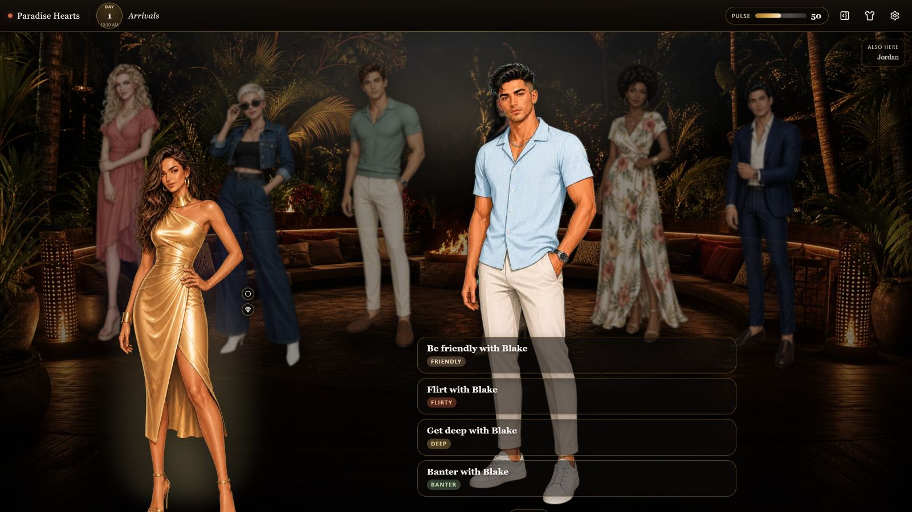
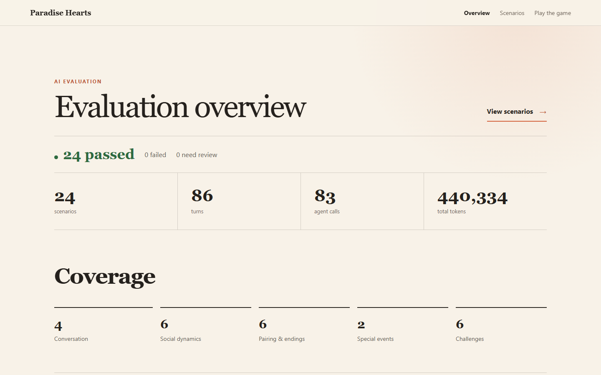
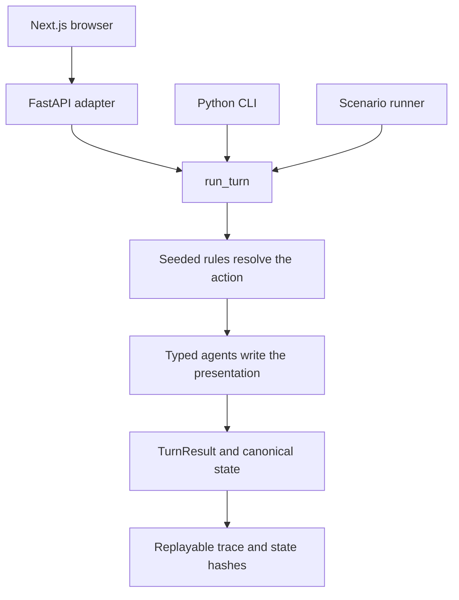

<div align="center">
  

  # Paradise Hearts

  **A playable reality-dating social simulation with deterministic rules and generated dialogue.**

  [Play the browser demo](https://paradise-hearts.vercel.app) ·
  [Review the latest eval run](https://paradise-hearts.vercel.app/evals) ·
  [Read the system docs](docs/INDEX.md) ·
  [See the current plan](docs/current-plan.md)
</div>

[](https://github.com/iamianM/llm-game/actions/workflows/qa.yml)

Paradise Hearts is a visual novel set inside a fictional reality dating show.
The player builds relationships, handles interruptions and rivalries, survives
pairing ceremonies, and tries to reach the final vote with a strong couple.

The Python engine owns every rule and state change. Language models write
dialogue, narration, contextual choices, gossip, and background scenes through
typed agent contracts. They cannot decide whether an action succeeds, change a
relationship score, eliminate a character, or move the game clock.

<table>
  <tr>
    <td width="50%"></td>
    <td width="50%"></td>
  </tr>
  <tr>
    <td align="center"><sub>The current browser scene, cast art, and interaction menu.</sub></td>
    <td align="center"><sub>A reviewed real run with 24 scenarios, 86 turns, and 82 recorded agent calls.</sub></td>
  </tr>
</table>

## The engineering boundary

Every browser action, CLI action, and eval scenario enters the same
`run_turn` pipeline:



| Area | Responsibility |
| --- | --- |
| `src/game/engine/` | Legal actions, seeded random numbers, relationships, ceremonies, challenges, votes, and eliminations |
| `src/game/agents/` | Typed dialogue, narration, choices, orchestration, gossip, and memory curation |
| `src/api/` | HTTP and server-sent events over the Python engine |
| `web/` | Next.js presentation and local UI state |
| `src/game/cli/` | Play sessions, checkpoints, replay, verification, and reports |
| `tests/` and `evals/` | Deterministic tests, browser contracts, and model behavior scenarios |

The split is deliberate. The model can vary the writing without changing game
truth. A bad response fails its schema or an eval instead of silently changing
the simulation.

## Replay and branch comparison

A trace stores the action, the mechanical result, recorded agent outputs, and
the input and output state hashes for every turn. Replay feeds those recorded
outputs through the production turn pipeline. It makes a model-backed session
repeatable without another model call.

Checkpoints also store the seeded random-number state. A playtester can resume
the same moment twice, choose different actions, and generate an HTML comparison
of both branches.

Read [Replay and review](docs/systems/replay-and-review.md) for the trace,
checkpoint, and report contracts.

## Evaluation evidence

The eval runner sends authored YAML scenarios through `run_turn`. Each turn
contains reviewed target outputs in the same typed shape as the recorded agent
results. The dashboard places the target and actual calls side by side, in call
order, with the responsible agent named on each result.

Deterministic checks protect engine and schema rules. One thread judge reviews
the complete scenario for continuity, voice, and faithfulness to the resolved
game state.

The checked-in real run contains:

- 24 passing scenarios across 86 turns
- 82 recorded agent calls
- 24 whole-scenario judge decisions
- 455,370 tokens
- $0.09868617 in recorded estimated cost

[Open the evaluation overview](https://paradise-hearts.vercel.app/evals) or read
[the eval system](docs/systems/llm-evals.md).

## Run the game

The [hosted demo](https://paradise-hearts.vercel.app) uses the same Python game
path as the CLI and scenario runner.

For local development, install [uv](https://docs.astral.sh/uv/) and Node.js 22
or newer:

```bash
git clone https://github.com/iamianM/llm-game.git
cd llm-game
uv sync --extra dev --locked
cd web
npm ci
```

Start the API and browser in separate terminals:

```bash
uv run python -m uvicorn src.api.app:app --host 127.0.0.1 --port 8000
```

```bash
cd web
npm run dev
```

Open `http://127.0.0.1:3000`. Local play uses deterministic mock agents unless
you opt into a live model and provide `OPENAI_API_KEY`.

## Use the CLI

Start a recorded deterministic session:

```bash
uv run python -m src.game.cli play --mock-llm --record .game_traces/demo.json
```

During play, `/checkpoint first-choice` saves the current state and random-number
state. `/hash` prints the deterministic state hash. `/background` shows recent
off-screen resort activity.

Replay the session without new model calls:

```bash
uv run python -m src.game.cli play --replay .game_traces/demo.json
```

Generate a review packet:

```bash
uv run python -m src.game.cli report packet \
  --trace .game_traces/demo.json \
  --out review-packet/demo
```

Read [CLI playtesting](docs/workflows/cli-playtesting.md) for checkpoint branches,
trace inspection, review notes, and comparison reports.

## Run the checks

The non-billed completion gate is:

```bash
make qa
```

It runs Python linting and type checks, content validation, non-LLM tests, a
scripted playthrough, deterministic replay checks, the mock eval pack,
TypeScript checks, and focused browser contracts. Live model runs remain
opt-in because they cost money and their text can vary.

Run the real scenario pack with the thread judge:

```bash
uv run python -m src.game.cli llm-eval \
  --out review-packet/llm-eval-real \
  --real-llm \
  --judge
```

## Current scope

The playable proof of concept includes the deterministic season loop, six
minigames, scene-based browser presentation, the CLI, the API, replay and branch
reports, current-run memory, background resort activity, and the eval system.

The current work focuses on making the first three in-game days denser and
clearer. Production authentication, telemetry, cloud persistence, cross-run
progression, and realtime voice are outside the current build.

Read [the current plan](docs/current-plan.md) for active work. `AGENTS.md` and
`ENGINEERING.md` contain the implementation rules for contributors and coding
agents.
