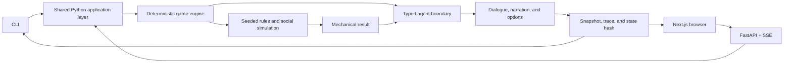

<div align="center">
  

  # Paradise Hearts

  **A deterministic social simulation with an LLM-powered reality-show narrator.**

  [Play the browser demo](https://paradise-hearts.vercel.app) ·
  [Read the architecture guide](AGENTS.md#architecture) ·
  [See the current plan](docs/current-plan.md)
</div>

[](https://github.com/iamianM/llm-game/actions/workflows/qa.yml)

Paradise Hearts is a playable visual-novel social sandbox set inside a fictional
reality dating show. The player builds relationships, navigates shifting
alliances, survives ceremonies, and tries to reach the final vote with a strong
couple and public support.

The project is also an experiment in reliable AI game architecture. A typed,
seeded Python engine owns every rule and state change. Specialized LLM agents
write dialogue, narration, contextual choices, gossip, and background resort
life only after the engine has resolved what happened.

## Why It Is Different

- **Deterministic mechanics, generative storytelling.** The model never decides
  scores, relationship deltas, legal actions, votes, eliminations, or phase
  progression.
- **One engine across every interface.** The CLI, FastAPI service, browser,
  scenarios, replay tooling, and tests all call the same Python turn pipeline.
- **Replayable AI interactions.** Seeded RNG, snapshots, action scripts, state
  hashes, and traces make social-simulation failures reproducible.
- **Evaluation is part of the product loop.** Golden scenarios exercise the
  production `run_turn` path in deterministic mock mode, with opt-in live-agent
  and judge-assisted review packets.
- **The social world keeps moving.** NPCs form couples, pursue their own needs,
  interrupt conversations, trade gossip, compete in challenges, and influence
  the audience while the player chooses where to spend limited time.

## Architecture



| Surface | Responsibility |
| --- | --- |
| `src/game/engine/` | Legal actions, seeded RNG, state transitions, relationships, ceremonies, challenges, votes, and eliminations |
| `src/game/agents/` | Typed wrappers for dialogue, narration, options, orchestration, gossip, and trait generation |
| `src/api/` | Thin FastAPI adapter over the canonical engine |
| `web/` | Next.js visual-novel client; browser state is presentation-only |
| `src/game/cli/` | Interactive play, deterministic verification, replay, checkpoints, and review tooling |
| `tests/` and `evals/` | Unit/property tests, seeded scenarios, API/browser contracts, and golden LLM evaluations |

## Try It

The [hosted demo](https://paradise-hearts.vercel.app) starts in deterministic
demo mode, so it does not require an API key. Choose an islander and play
through the same engine path used by the CLI and automated scenarios.

For a local run, install [uv](https://docs.astral.sh/uv/) and Node.js 22+, then:

```bash
git clone https://github.com/iamianM/llm-game.git
cd llm-game
uv sync --extra dev --locked
cd web && npm ci && cd ..
```

Start the API and browser in separate terminals:

```bash
uv run python -m uvicorn src.api.app:app --host 127.0.0.1 --port 8000
```

```bash
cd web
npm run dev
```

Open `http://127.0.0.1:3000`. The browser uses deterministic mock agents by
default. To explore the engine without the browser:

```bash
uv run python -m src.game.cli play --mock-llm
```

Live-agent play is optional and requires `OPENAI_API_KEY`; deterministic demo
mode covers the complete mechanical path without a paid model call.

## Quality And Reproducibility

The non-LLM completion gate is one command:

```bash
make qa
```

It runs Python linting and strict type checks, content validation, the non-LLM
pytest suite, a scripted smoke playthrough, deterministic scenario verification,
mock golden LLM evaluations, TypeScript checks, and focused Playwright browser
contracts. Live model and judge runs are intentionally separate because they
are slower, billed, and nondeterministic.

Useful debugging surfaces include:

```bash
uv run python -m src.game.cli verify --all
uv run python -m src.game.cli verify-script --actions tests/scenarios/fixtures/day1-happy-path.yaml
uv run python -m src.game.cli snapshot inspect fixtures/snapshots/<snapshot>.json
uv run python -m src.game.cli trace inspect .game_traces/<trace>.json
```

## Project Status

Paradise Hearts is a playable proof of concept being hardened into a stronger
vertical slice. The deterministic season loop, CLI, API, browser, replay
infrastructure, and evaluation system exist today. Current work focuses on
making the first three in-game days more legible and emotionally engaging in
the browser, then using real evaluation failures to improve agent behavior.

Production hosting, authentication, telemetry, durable cloud persistence,
cross-run progression, and realtime voice are deliberately outside the current
POC boundary. See [docs/current-plan.md](docs/current-plan.md) for the active
scope rather than historical build checklists.

## Documentation

- [AGENTS.md](AGENTS.md) is the engineering and architecture entry point.
- [ENGINEERING.md](ENGINEERING.md) defines the non-negotiable implementation rules.
- [docs/qa-strategy.md](docs/qa-strategy.md) explains the confidence layers and completion gate.
- [docs/llm-eval-system.md](docs/llm-eval-system.md) documents golden scenario review.
- [docs/decisions/](docs/decisions/) records the major architecture choices.

The project is AI-assisted, but its core contract is intentionally model-proof:
human-authored schemas and deterministic code own game truth, while models are
limited to creative expression behind typed, inspectable boundaries.
