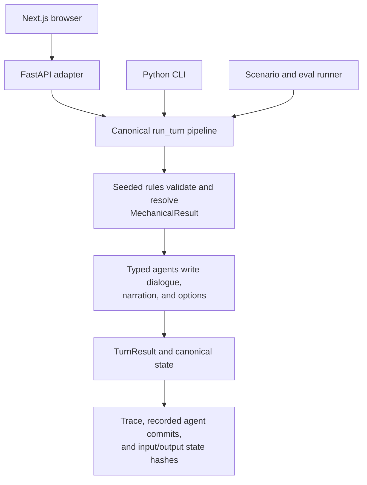
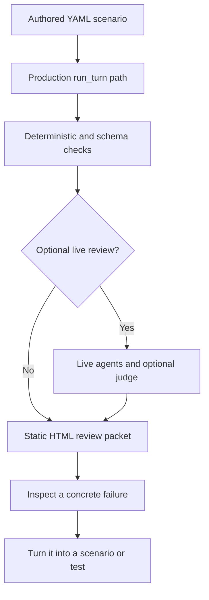

<div align="center">
  

  # Paradise Hearts

  **A deterministic social simulation with an LLM-powered reality-show cast.**

  [Play the browser demo](https://paradise-hearts.vercel.app) ·
  [Inspect a real Luna eval run](https://paradise-hearts.vercel.app/evals) ·
  [Explore the systems](docs/INDEX.md) ·
  [See the current plan](docs/current-plan.md)
</div>

[](https://github.com/iamianM/llm-game/actions/workflows/qa.yml)

Paradise Hearts is a playable visual-novel social sandbox set inside a fictional
reality dating show. You build relationships, navigate rivalries and shifting
alliances, survive pairing ceremonies, and try to reach the final vote with a
strong couple and public support.

The game is also a working answer to a harder engineering question: **how can
an LLM make a game feel authored without letting nondeterministic text generation
control game truth?** Here, typed Python code owns the simulation. Specialized
agents express its results as dialogue, narration, contextual choices, gossip,
and background resort life.

<table>
  <tr>
    <td width="50%"></td>
    <td width="50%"></td>
  </tr>
  <tr>
    <td align="center"><sub>Current cinematic introductions rendered from canonical Python state.</sub></td>
    <td align="center"><sub>Current mock pack: 24 scenarios, 86 turns, fully inspectable evidence.</sub></td>
  </tr>
</table>

## What Makes It Interesting

### Deterministic mechanics, generative expression

The LLM never calculates success, relationship deltas, action legality,
challenge scores, votes, eliminations, or phase movement. The engine resolves a
typed `MechanicalResult` first; agents then write within that result. This keeps
creative output flexible without making the rules unverifiable.

### AI interactions that can actually be replayed

A trace records the action, input and output state hashes, mechanical result,
visible state, narration, dialogue, contextual options, agent commits, and
review bookmarks for every turn. Replay reconstructs the original seeded game,
feeds the recorded agent commits back through the production turn pipeline, and
checks both hashes on every step. It makes an AI-assisted playthrough
reproducible **without making another model call**.

### Checkpoint branches, not save-file guesswork

Checkpoints preserve canonical state and seeded RNG state. A tester can resume
the same moment twice, choose different actions, and generate a side-by-side
HTML comparison of the consequences. That turns narrative iteration into an
evidence-driven workflow instead of a memory exercise.

### Golden evals through the real game path

Human-authored YAML scenarios run through the same `run_turn` function used by
the browser and CLI. Fast deterministic and schema checks run first. Optional
live-agent runs add one whole-thread judge pass per scenario for voice,
continuity, and faithfulness review. Each run produces a searchable static
dashboard containing the scenario's intent, raw outputs, checks, model and
reasoning profiles, latency/token provenance, prompt hashes, inputs, and
reasoning summaries.

### A CLI that is a playtest control plane

The CLI is not a demo wrapper. It supports interactive and persisted sessions,
named checkpoints, trace replay, deterministic scripts, state inspection,
review notes, report packets, branch comparison, and golden LLM evals. Those
surfaces make difficult social-simulation bugs reproducible before the browser
presentation is involved.

## Architecture

The browser, CLI, and eval harness are different interfaces over one turn path:



The evidence loop is deliberately separate from the runtime diagram:



| Area | Owns |
| --- | --- |
| `src/game/engine/` | Legal actions, seeded RNG, social simulation, relationships, ceremonies, challenges, votes, and eliminations |
| `src/game/agents/` | Typed dialogue, narration, contextual options, orchestration, gossip, curation, and trait generation |
| `src/api/` | Thin HTTP and SSE adapter over the canonical engine |
| `web/` | Next.js visual-novel presentation; canonical game state stays in Python |
| `src/game/cli/` | Play, persistence, checkpoints, replay, deterministic verification, and reports |
| `tests/` and `evals/` | Unit/property checks, seeded scenarios, browser/API contracts, and golden LLM evaluations |

For the deeper contracts, see [Replay and review](docs/systems/replay-and-review.md),
[LLM evals](docs/systems/llm-evals.md), and
[Browser and API](docs/systems/browser-and-api.md).

## Try It

The [hosted demo](https://paradise-hearts.vercel.app) runs in deterministic demo
mode and does not require an API key. Create a Heartbreaker, meet the cast, and
play through the same Python engine path used by automated scenarios.

For local development, install [uv](https://docs.astral.sh/uv/) and Node.js 22+:

```bash
git clone https://github.com/iamianM/llm-game.git
cd llm-game
uv sync --extra dev --locked
cd web && npm ci && cd ..
```

Start the API and browser in separate terminals:

```bash
uv run python -m uvicorn src.api.app:app --host 127.0.0.1 --port 8000
```

```bash
cd web
npm run dev
```

Open `http://127.0.0.1:3000`. The browser uses deterministic mock agents by
default. Live-agent play is opt-in and requires `OPENAI_API_KEY`.

## Explore the CLI

Start an interactive deterministic session:

```bash
uv run python -m src.game.cli play --mock-llm --record .game_traces/demo.json
```

Inside a session, `/checkpoint first-choice` captures state plus RNG, `/hash`
prints the deterministic state hash, and `/background` exposes recent off-screen
resort activity.

Replay the recording with no new LLM calls:

```bash
uv run python -m src.game.cli play --replay .game_traces/demo.json
```

Branch from the same checkpoint and compare the outcomes:

```bash
uv run python -m src.game.cli play --from-checkpoint .game_saves/first-choice.json --branch-name bold
uv run python -m src.game.cli play --from-checkpoint .game_saves/first-choice.json --branch-name loyal
uv run python -m src.game.cli report compare \
  --checkpoint .game_saves/first-choice.json \
  --trace-a .game_traces/bold.json \
  --trace-b .game_traces/loyal.json \
  --out review-packet/choice-comparison.html
```

Generate a full review packet from any recorded playthrough:

```bash
uv run python -m src.game.cli report packet \
  --trace .game_traces/demo.json \
  --out review-packet/demo
```

See [CLI playtesting](docs/workflows/cli-playtesting.md) for the complete
session-and-review workflow.

## Run the Evals

The default golden pack uses deterministic mock agents, runs scenarios in
parallel, and writes a browser-readable report:

```bash
uv run python -m src.game.cli llm-eval --out review-packet/llm-eval-mock
```

The current pack contains **24 authored scenarios covering 86 turns and 26
whole-thread semantic checks**. A mock
run validates the harness, schemas, invariants, and expected story beats without
spending model tokens. With an API key, the same scenarios can exercise live
agents and an optional LLM judge:

```bash
uv run python -m src.game.cli llm-eval \
  --out review-packet/llm-eval-real \
  --real-llm \
  --judge
```

Read [the LLM eval system](docs/systems/llm-evals.md) for scenario anatomy,
judge policy, artifacts, and the failure-to-regression workflow.

## Quality and Reproducibility

The non-billed completion gate is one command:

```bash
make qa
```

It runs Python linting and strict type checks, content validation, the non-LLM
test suite, a scripted smoke playthrough, deterministic scenario verification,
the mock golden eval pack, TypeScript checks, and focused Playwright action
contracts. Live model checks stay opt-in because they are slower, billed, and
nondeterministic.

Useful focused checks:

```bash
uv run python -m src.game.cli verify --all
uv run python -m src.game.cli verify-script --actions tests/scenarios/fixtures/day1-happy-path.yaml
uv run python -m src.game.cli snapshot inspect fixtures/snapshots/<snapshot>.json
uv run python -m src.game.cli trace inspect .game_traces/<trace>.json
```

## Project Status

Paradise Hearts is a playable proof of concept being hardened into a stronger
vertical slice. The deterministic season loop, all six minigames, scene-based
browser presentation, CLI, API, replay infrastructure, current-run knowledge,
and evaluation system exist today. Current work focuses on the first three
in-game days, clearer audience feedback, and failure-driven live-agent tuning.

Production authentication, telemetry, durable cloud persistence, cross-run
progression, and realtime voice are intentionally outside the POC boundary.
The [current plan](docs/current-plan.md) is the source of truth for active scope.

## Documentation

- [Documentation index](docs/INDEX.md) separates current system contracts from design, research, decisions, and implementation history.
- [AGENTS.md](AGENTS.md) is the AI-assistant and engineering entry point.
- [ENGINEERING.md](ENGINEERING.md) defines the non-negotiable implementation rules.
- [QA](docs/systems/qa.md) explains the confidence layers and completion gate.
- [Architecture decisions](docs/decisions/) record why major boundaries exist.

Historical build plans and superseded phase specifications remain available
under [`docs/archive/`](docs/archive/) for implementation archaeology, but they
are not current instructions.
